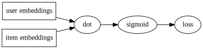
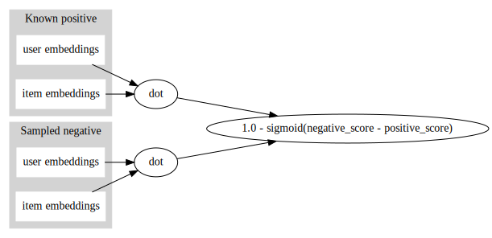

# Neural networks for recommendations

Maciej Kula

## Motivation

The rise of deep learning has given us new techniques and neural network toolkits which are useful even if your models aren't particularly deep, and do not rely on sophisticated hierarchical representations.

### Flexibility

Don't have to painstakingly implement complicated SGD models by hand.

Build them up from simple elements instead and let the framework take care of the fitting.

If we're doing recommendations, this means we can freely experiment with adding side information and using new loss functions to tailor models to our unique problem

### New modelling techniques

Secondly, the elements we can use are substantially improve on what was possible before
- CNNs for including image data
- RNNs for sequence prediction.

In this talk, I'm going to show off these qualities by doing three things:
- translating a classic matrix factorization model into a neural network toolkit,
- quickly building a number of ranking losses to use with it, and
- switching out the factorization model for a sequence-based one.

## Factorization models
Take a sparse user-item interaction matrix, and factorize it as a product of two dense matrices of user and item latent vectors.

$$
I = \begin{pmatrix}
  1.0 & 0.0 & \cdots & 1.0 \\
  0.0 & 1.0 & \cdots & 0.0 \\
  \vdots  & \vdots  & \ddots & \vdots  \\
  1.0 & 1.0 & \cdots & 1.0 
 \end{pmatrix}
$$


Famously introduced during the Netflix Prize contest, and still a workhorse in its more modern implicit feedback form.

### Bilinear neural network model




- two embedding layers, for users and items
- connected by a dot product
- fit with negative sampling and logistic loss.

```python
class BilinearNet(nn.Module):

    def __init__(self, num_users, num_items, embedding_dim, sparse=False):
        super().__init__()

        self.embedding_dim = embedding_dim

        self.user_embeddings = ScaledEmbedding(num_users, embedding_dim,
                                               sparse=sparse)
        self.item_embeddings = ScaledEmbedding(num_items, embedding_dim,
                                               sparse=sparse)
        self.user_biases = ZeroEmbedding(num_users, 1, sparse=sparse)
        self.item_biases = ZeroEmbedding(num_items, 1, sparse=sparse)

    def forward(self, user_ids, item_ids):

        # snip
```

```python
class BilinearNet(nn.Module):

    def __init__(self, num_users, num_items, embedding_dim, sparse=False):
      
        # snip

    def forward(self, user_ids, item_ids):

        user_embedding = self.user_embeddings(user_ids)
        item_embedding = self.item_embeddings(item_ids)

        user_embedding = user_embedding.view(-1, self.embedding_dim)
        item_embedding = item_embedding.view(-1, self.embedding_dim)

        user_bias = self.user_biases(user_ids).view(-1, 1)
        item_bias = self.item_biases(item_ids).view(-1, 1)

        dot = (user_embedding * item_embedding).sum(1)

        return dot + user_bias + item_bias
```

### Sampled loss function

For the loss, we could output scores for all possible items, trying to predict 1 for all items the user interacted with, and 0 for all other items.

In practice use a sampling approach: compute loss for all positive interactions and a sample of missing ones.

```python
    def _pointwise_loss(self, users, items, ratings):

        negatives = Variable(
            _gpu(
                torch.from_numpy(np.random.randint(0,
                                                   self._num_items,
                                                   len(users))),
                self._use_cuda)
        )

        positives_loss = (1.0 - F.sigmoid(self._net(users, items)))
        negatives_loss = F.sigmoid(self._net(users, negatives))

        return torch.cat([positives_loss, negatives_loss]).mean()
```


```python
import numpy as np
import scipy.sparse as sp

from netrex.netrex import FactorizationModel, SequenceModel, generate_sequences
from netrex.evaluation import auc_score, mrr_score

from lightfm.datasets import fetch_movielens

def _binarize(dataset):

    dataset = dataset.copy()

    dataset.data = (dataset.data >= 0.0).astype(np.float32)
    dataset = dataset.tocsr()
    dataset.eliminate_zeros()

    return dataset.tocoo()

movielens = fetch_movielens()
ratings_train, ratings_test = movielens['train'], movielens['test']
train, test = _binarize(movielens['train']), _binarize(movielens['test'])

embedding_dim = 128
minibatch_size = 1024
n_iter = 10
cuda = True
```

### Let's run it


```python
model = FactorizationModel(loss='pointwise',
                           n_iter=n_iter,
                           embedding_dim=embedding_dim,
                           batch_size=minibatch_size,
                           use_cuda=cuda)

model.fit(train)

print('MRR score: {:.2f}'.format(mrr_score(model, test, train).mean()))
```

    MRR score: 0.06


### Ranking losses
This model is good, but we can do better with a ranking loss.

 $$
 L = 1.0 - \mathrm{sigmoid}(\mathrm{positive} - \mathrm{negative})
 $$

 - Construct triplets of (user, positive, negative item)
 - Positive item should be ranked higher than negative item.

### Use a siamese network

- re-use the embedding representation from before
- compute the score for the positive and negative item using shared embedding layers
- feed it into the pairwise loss.

### Use a siamese network



### Use a siamese network

```python
    def _bpr_loss(self, users, items, ratings):

        negatives = Variable(
            _gpu(
                torch.from_numpy(np.random.randint(0,
                                                   self._num_items,
                                                   len(users))),
                self._use_cuda)
        )

        return (1.0 - F.sigmoid(self._net(users, items) -
                                self._net(users, negatives))).mean()
```


```python
model = FactorizationModel(loss='bpr',
                           n_iter=n_iter,
                           embedding_dim=embedding_dim,
                           batch_size=minibatch_size,
                           use_cuda=cuda)

model.fit(train)

print('MRR score: {:.2f}'.format(mrr_score(model, test, train).mean()))
```

    MRR score: 0.08


### Adaptive ranking loss
That's an improvement, but we can do even better.

Sample a couple of negative examples, and pick the ones that are closes to violating the correct ranking in your model.

### Adaptive ranking loss
```python
    def _adaptive_loss(self, users, items, ratings):

        negative_predictions = []

        for _ in range(5):
            negatives = Variable(
                _gpu(
                    torch.from_numpy(np.random.randint(0,
                                                       self._num_items,
                                                       len(users))),
                    self._use_cuda)
            )

            negative_predictions.append(self._net(users, negatives))

        best_negative_prediction, _ = torch.cat(negative_predictions, 1).max(1)
        positive_prediction = self._net(users, items)

        return torch.mean(torch.clamp(best_negative_prediction -
                                      positive_prediction
                                      + 1.0, 0.0))
```


```python
model = FactorizationModel(loss='adaptive',
                           n_iter=n_iter,
                           embedding_dim=embedding_dim,
                           batch_size=minibatch_size,
                           use_cuda=cuda)

model.fit(train)

print('MRR score: {:.2f}'.format(mrr_score(model, test, train).mean()))
```

    MRR score: 0.11


### Flexibility
Same representation, a number of ranking losses.

Trivial to implement.

We can now keep the loss functions but switch out the representation.

## Recommendations as sequence prediction

Users interact with items in an approximately sequential manner.

We can treat recommending items for a given user as trying to predict the next item in a sequence.


If a user bought items `a`, `b`, `c`, and `d`, we'd like to predict 

```python
[a] -> b
[a, b] -> c
[a, b, c] -> d
```

## Sequence-based user representation

There is a number of ways of doing so, but they all consist in representing the user as a function of the items they've bought in the past.

The user representation can be:

- the average of the item vectors that they bought before ([Covington et al.](https://research.google.com/pubs/pub45530.html))
- a RNN ([Hidasi et al.](https://arxiv.org/pdf/1511.06939.pdf))
- a CNN

## Advantages
- captures sequential information
- less pressing need to retrain: predictions automatically adapt as user purchase history grows

## Disadvantages:
- model slower to evaluate
- smaller benefit if data has no clear sequential structure

### User representation vs loss function

Note that user representation is separate from the loss used, so we can use the BPR and adaptive ranking losses with sequence-based models too.

## Examples

### Data preparation

Transform data into left-padded sequences. `[a, b, c, d]` becomes:
    
```python
[0, a, b, c] -> [a, b, c, d]
```

This is a single row of the input matrix, but expresses four predictions: 
```python
[0] -> a
[0, a] -> b
[0, a, b] -> c
[0, a, b, c] -> d
```

Could also split subsequences into separate training examples, making the input matrix
```python
[0, 0, 0, 0] -> a
[0, 0, 0, a] -> b
[0, 0, a, b] -> c
[0, a, b, c] -> d
```
This is more flexible, but requires computing outputs of the RNN multiple times over, making fitting slower.

### Representations
We're going to try a pooling-based and a recurrent representation (as well as a popularity baseline to make sure we're learning anything at all!).


```python
class PoolNet(nn.Module):

    def __init__(self, num_items, embedding_dim, sparse=False):
        super().__init__()

        self.embedding_dim = embedding_dim

        self.item_embeddings = ScaledEmbedding(num_items, embedding_dim,
                                               sparse=sparse,
                                               padding_idx=0)
        self.item_biases = ZeroEmbedding(num_items, 1, sparse=sparse,
                                         padding_idx=0)

    def forward(self, item_sequences, item_ids):

        target_embedding = self.item_embeddings(item_ids)
        user_representations = torch.cumsum(
            self.item_embeddings(item_sequences),
            1
        )

        target_bias = self.item_biases(item_ids)

        dot = (user_representations * target_embedding).sum(2)

        return dot + target_bias
```

```python
class LSTMNet(nn.Module):

    def __init__(self, num_items, embedding_dim, sparse=False):
        super().__init__()

        self.embedding_dim = embedding_dim

        self.item_embeddings = ScaledEmbedding(num_items, embedding_dim,
                                               sparse=sparse,
                                               padding_idx=0)
        self.item_biases = ZeroEmbedding(num_items, 1, sparse=sparse,
                                         padding_idx=0)

        self.lstm = nn.LSTM(batch_first=True,
                            input_size=embedding_dim,
                            hidden_size=embedding_dim)

    def forward(self, item_sequences, item_ids):

        target_embedding = self.item_embeddings(item_ids)
        user_representations, _ = self.lstm(
            self.item_embeddings(item_sequences)
        )
        target_bias = self.item_biases(item_ids)

        dot = (user_representations * target_embedding).sum(2)

        return dot + target_bias
```

### Let's run this!

Load the MovieLens data:


```python
from netrex import rnn_data
from netrex.netrex import FactorizationModel, SequenceModel, generate_sequences

sequence_data = rnn_data.fetch_movielens()
train_sequences, train_targets = generate_sequences(sequence_data['train'])
test_sequences, test_targets = generate_sequences(sequence_data['test'])

print('Predicting from [{}] to [{}]'.format(
    ', '.join((str(x) for x in train_sequences[1, :5])),
    ', '.join((str(x) for x in train_targets[1, :5]))
))
```

    Predicting from [0, 130, 190, 31, 28] to [130, 190, 31, 28, 52]


Set up the models, starting with a popularity baseline.


```python
embedding_dim = 128
minibatch_size = 64
n_iter = 10
cuda = True
```

### Popularity


```python
model = SequenceModel(loss='bpr',
                      representation='popularity',
                      n_iter=n_iter,
                      embedding_dim=embedding_dim,
                      batch_size=minibatch_size,
                      use_cuda=cuda)

model.fit(train_sequences, train_targets, verbose=False)

print('MRR on training set {:.2f}'.format(
    model.compute_mrr(train_sequences, train_targets, num_samples=200).mean()
))
print('MRR on test set {:.2f}'.format(
    model.compute_mrr(test_sequences, test_targets, num_samples=200).mean()
))
```

    MRR on training set 0.12
    MRR on test set 0.12


### Pooling


```python
model = SequenceModel(loss='bpr',
                      representation='pool',
                      n_iter=n_iter,
                      embedding_dim=embedding_dim,
                      batch_size=minibatch_size,
                      use_cuda=cuda)

model.fit(train_sequences, train_targets, verbose=False)

print('MRR on training set {:.2f}'.format(
    model.compute_mrr(train_sequences, train_targets, num_samples=200).mean()
))
print('MRR on test set {:.2f}'.format(
    model.compute_mrr(test_sequences, test_targets, num_samples=200).mean()
))
```

    MRR on training set 0.17
    MRR on test set 0.14


### LSTM


```python
model = SequenceModel(loss='bpr',
                      representation='lstm',
                      n_iter=n_iter,
                      embedding_dim=embedding_dim,
                      batch_size=minibatch_size,
                      use_cuda=cuda)

model.fit(train_sequences, train_targets, verbose=False)

print('MRR on training set {:.2f}'.format(
    model.compute_mrr(train_sequences, train_targets, num_samples=200).mean()
))
print('MRR on test set {:.2f}'.format(
    model.compute_mrr(test_sequences, test_targets, num_samples=200).mean()
))
```

    MRR on training set 0.12
    MRR on test set 0.11


### Oops.

LSTMs beat popularity (yay!) but perform worse than pooling.
- bad hyperparameters?
- sequence information not important?
- did we get the model architecture wrong?

### Sanity check
Generate data with obvious sequential strucure and try again.

Use number sequences: `[0, 1, 2, 3, ...] -> [1, 2, 3, 4, ...]`


```python
import numpy as np
import scipy.sparse as sp

def generate_sequential_interactions(sequence_len, num_rows):

    return sp.csr_matrix(np.tile(np.arange(sequence_len) + 1, (num_rows, 1)))

train_sequences, train_targets = generate_sequences(generate_sequential_interactions(20, 1000))
test_sequences, test_targets = generate_sequences(generate_sequential_interactions(20, 1000))
```


```python
model = SequenceModel(loss='bpr',
                      representation='popularity',
                      n_iter=n_iter,
                      embedding_dim=embedding_dim,
                      batch_size=minibatch_size,
                      use_cuda=cuda)

model.fit(train_sequences, train_targets, verbose=False)

print('MRR on training set {:.2f}'.format(
    model.compute_mrr(train_sequences, train_targets, num_samples=200).mean()
))
print('MRR on test set {:.2f}'.format(
    model.compute_mrr(test_sequences, test_targets, num_samples=200).mean()
))
```

    MRR on training set 0.07
    MRR on test set 0.07


```python
model = SequenceModel(loss='bpr',
                      representation='pool',
                      n_iter=n_iter,
                      embedding_dim=embedding_dim,
                      batch_size=minibatch_size,
                      use_cuda=cuda)

model.fit(train_sequences, train_targets, verbose=False)

print('MRR on training set {:.2f}'.format(
    model.compute_mrr(train_sequences, train_targets, num_samples=200).mean()
))
print('MRR on test set {:.2f}'.format(
    model.compute_mrr(test_sequences, test_targets, num_samples=200).mean()
))
```

    MRR on training set 0.13
    MRR on test set 0.13


```python
model = SequenceModel(loss='bpr',
                      representation='lstm',
                      n_iter=n_iter,
                      embedding_dim=embedding_dim,
                      batch_size=minibatch_size,
                      use_cuda=cuda)

model.fit(train_sequences, train_targets, verbose=False)

print('MRR on training set {:.2f}'.format(
    model.compute_mrr(train_sequences, train_targets, num_samples=200).mean()
))
print('MRR on test set {:.2f}'.format(
    model.compute_mrr(test_sequences, test_targets, num_samples=200).mean()
))
```

    MRR on training set 0.77
    MRR on test set 0.77


### Sanity check

Fantastic: LSTMs do give us great results on dataset where the sequential nature of interactions is important.

## Summary
Amazing flexibility.

Powerful building blocks.

Speed of iteration.

## Summary
Is everything perfect? No.

Fitting NN models on sparse problems can be slow.
- use sparse gradients on the CPU?
- run on GPU with huge minibatches?
